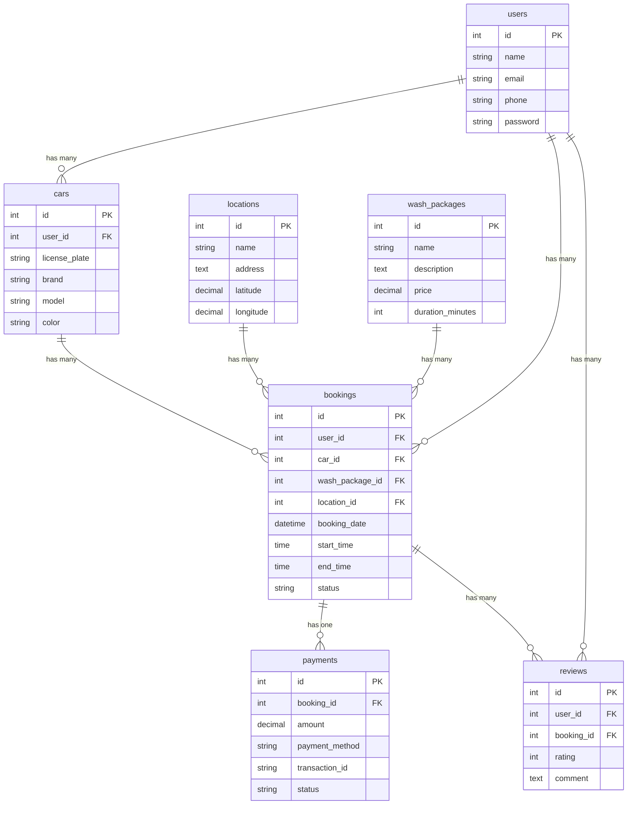

# Proyek Tantangan Magang: Backend & Copywriter

Repositori ini berisi penyelesaian dua tantangan teknis sebagai bagian dari proses seleksi magang di BuildWithAngga, yaitu "Magang Backend Laravel 2026" dan "Copywriter Backend Laravel - Batch 1".

---

## Tantangan 1: Magang Backend Laravel 2026

Proyek ini adalah solusi backend untuk situs web pemesanan cuci mobil. Tujuan utamanya adalah merancang dan mengimplementasikan struktur database menggunakan Laravel.

> **Tantangan:** "Untuk memastikan alur kerja magang yang lebih lancar, Anda diminta untuk menyelesaikan tantangan sederhana. Sebagai pengembang backend, Anda perlu merancang ERD untuk situs web pemesanan cuci mobil, kemudian membuat migrasi menggunakan Laravel 12, dan mengunggah karya Anda ke repositori publik untuk ulasan kami."

### Entity-Relationship Diagram (ERD)

Berikut adalah desain ERD yang menggambarkan hubungan antar tabel dalam database aplikasi ini.



### Persyaratan Sistem

- PHP: ^8.2
- Composer
- Laravel: ^12.0
- Database (MySQL, PostgreSQL, SQLite, dll.)

### Panduan Instalasi

1.  **Clone Repositori**
    ```bash
    git clone https://github.com/Adptra01/car-wash.git
    cd car-wash
    ```

2.  **Instal Dependensi**
    ```bash
    composer install
    ```

3.  **Konfigurasi Lingkungan**
    ```bash
    cp .env.example .env
    ```

4.  **Generate Kunci Aplikasi**
    ```bash
    php artisan key:generate
    ```

5.  **Konfigurasi Database**
    Buka file `.env` dan sesuaikan pengaturan database Anda.

6.  **Jalankan Migrasi Database**
    ```bash
    php artisan migrate
    ```

7.  **Jalankan Aplikasi**
    ```bash
    php artisan serve
    ```

### Penjelasan Struktur Proyek

- **/app**: Berisi logika inti aplikasi (Models, Controllers, Providers).
- **/database**: Berisi migrasi, seeder, dan factory database.
- **/routes**: Tempat semua definisi rute aplikasi.

---

## Tantangan 2: Copywriter Backend Laravel - Batch 1

Sebagai bagian dari proses seleksi, tantangan ini berfokus pada kemampuan riset, penulisan, dan penjelasan teknis yang menarik bagi audiens pemula.

> **Tantangan:** "Sebagai bagian dari proses seleksi magang backend copywriter di BuildWithAngga, kamu diminta untuk menulis sebuah artikel pendek yang membahas topik seputar backend development, dengan fokus pada framework Laravel. Artikel ini ditujukan untuk pembaca pemula hingga menengah yang sedang belajar web development. Pastikan kamu menggunakan gaya bahasa yang mudah dipahami, edukatif, dan tetap engaging. Gunakan kata kunci seperti *Laravel*, *backend development*, dan *web developer pemula* secara alami dalam tulisanmu. Kamu bebas memilih topik spesifik seperti “Kenapa Laravel Cocok untuk Pemula,” “Cara Membuat API Sederhana dengan Laravel,” atau “5 Fitur Keren Laravel yang Wajib Kamu Coba.” Artikel dapat kamu publikasikan di [medium.com](https://medium.com) atau di blog pribadi kamu. Setelah artikel selesai dan dipublikasikan, silakan kirim link-nya kepada kami untuk dinilai. Challenge ini bertujuan untuk melihat kemampuanmu dalam meriset, menyusun struktur tulisan, dan menjelaskan hal teknis secara jelas dan menarik bagi pembaca yang sedang belajar menjadi web developer."

### Hasil Artikel

Beberapa artikel yang relevan dengan tantangan ini telah ditulis dan dipublikasikan. Artikel-artikel tersebut membahas berbagai topik seputar **Laravel** dan **backend development**, yang dirancang khusus untuk **web developer pemula**.

Anda dapat membaca artikel-artikel tersebut melalui tautan berikut:

**[Kumpulan Artikel Laravel di Akar Solution](https://akar-solution.page.gd/?s=laravel)**