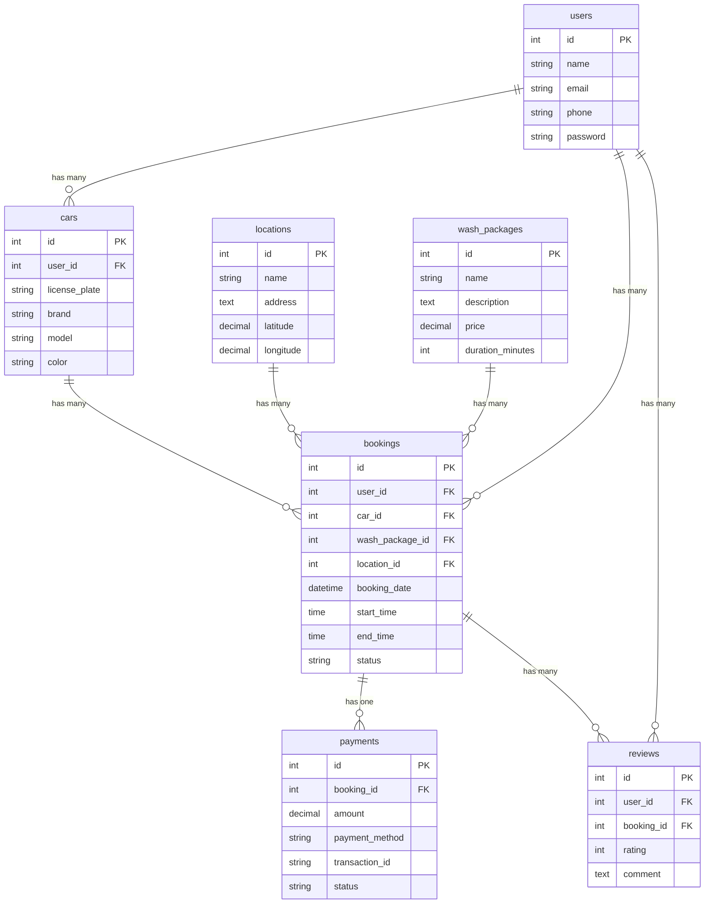

# Proyek Website Pemesanan Cuci Mobil

Proyek ini adalah solusi backend untuk situs web pemesanan cuci mobil, yang dibuat sebagai bagian dari tantangan teknis untuk proses magang. Tujuan utamanya adalah merancang dan mengimplementasikan struktur database menggunakan Laravel.

## Tantangan

> "Untuk memastikan alur kerja magang yang lebih lancar, Anda diminta untuk menyelesaikan tantangan sederhana. Sebagai pengembang backend, Anda perlu merancang ERD untuk situs web pemesanan cuci mobil, kemudian membuat migrasi menggunakan Laravel 12, dan mengunggah karya Anda ke repositori publik untuk ulasan kami."

## Entity-Relationship Diagram (ERD)

Berikut adalah desain ERD yang menggambarkan hubungan antar tabel dalam database aplikasi ini.



## Persyaratan Sistem

- PHP: ^8.2
- Composer
- Laravel: ^12.0
- Database (MySQL, PostgreSQL, SQLite, dll.)

## Panduan Instalasi

1.  **Clone Repositori**
    ```bash
    git clone https://github.com/Adptra01/car-wash.git
    cd car-wash
    ```

2.  **Instal Dependensi**
    ```bash
    composer install
    ```

3.  **Konfigurasi Lingkungan**
    Salin file `.env.example` menjadi `.env`.
    ```bash
    cp .env.example .env
    ```

4.  **Generate Kunci Aplikasi**
    ```bash
    php artisan key:generate
    ```

5.  **Konfigurasi Database**
    Buka file `.env` dan sesuaikan pengaturan database Anda (DB_CONNECTION, DB_HOST, DB_PORT, DB_DATABASE, DB_USERNAME, DB_PASSWORD).

6.  **Jalankan Migrasi Database**
    Perintah ini akan membuat semua tabel yang diperlukan dalam database Anda.
    ```bash
    php artisan migrate
    ```

7.  **Jalankan Aplikasi**
    ```bash
    php artisan serve
    ```
    Aplikasi sekarang akan berjalan di `http://127.0.0.1:8000`.

## Penjelasan Struktur Proyek

- **/app**: Berisi logika inti aplikasi, termasuk Models, Controllers, dan Providers.
- **/bootstrap**: Berisi file untuk bootstraping framework.
- **/config**: Menyimpan semua file konfigurasi aplikasi.
- **/database**: Berisi migrasi, seeder, dan factory untuk database.
  - **/database/migrations**: File-file migrasi yang mendefinisikan skema database.
- **/public**: Direktori root dokumen untuk aplikasi Anda.
- **/resources**: Berisi file-file view (Blade templates), aset mentah (CSS, JS), dan file bahasa.
- **/routes**: Tempat semua definisi rute untuk aplikasi Anda (web.php, api.php).
- **/storage**: Berisi file-file yang dihasilkan oleh framework, seperti cache, session, dan log.
- **/tests**: Berisi file-file pengujian otomatis (unit dan feature tests).
- **composer.json**: Mendefinisikan dependensi PHP proyek.
- **.env**: File konfigurasi lingkungan untuk kredensial, kunci API, dll.
